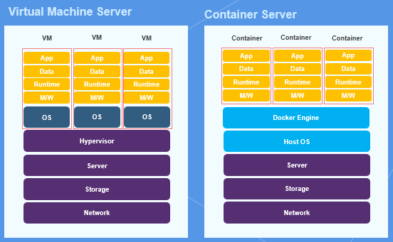
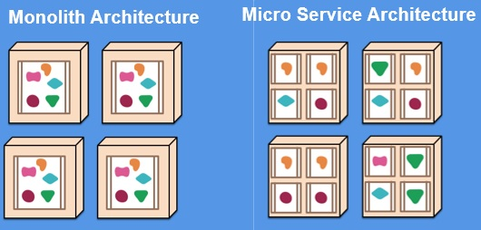

- [Kubernetes](/Infra/Kubernetes.md)
- [Docker](/Infra/Docker.md)
자세한 쿠버네티스와 도커의 내용은 위 링크에서 자세하게 살펴보실 수 있습니다.

# 컨테이너란 무엇인가?
사전적 의미로 컨테이너는 어떤 물체를 격리하는 공간을 뜻한다. 클라우드 분야에서 컨테이너는 다음과 같은 의미를 갖는다. ** 컨테이너는 애플리케이션과 애플리케이션을 구동하는 환경을 격리하는 공간을 뜻한다 ** 사실 컨테이너 기술은 새로운 개념이 아닌, 약 10여 년 전에 리눅스에 내장된 기술이다. 

# 컨테이너를 사용하는 이유는 무엇인가?

서버 장비들은 컴퓨팅 환경을 소프트웨어로 구현한 가상머신(VM: Virtual Machine)을 사용한다. 이 서버들은 다수의 운영체제를 동시에 실행하기 위해 하이퍼바이저가 필요하고, 그 상위 계층에 Guest OS가 각각 설치된 가상머신들을 구동시킨다. 
반면에 컨테이너로 구성된 서버는 하이퍼바이저를 사용하지 않고 CPU, RAM, Disk, Network과 같은 운영체제의 자원을 필요한 만큼 격리하여 컨테이너에 할당한다.

# 컨테이너의 장점

* 컨테이너는 효율성이 높다

기업들은 실제 애플리케이션 서비스를 안정적으로 운영하기 위해 1개의 가상머신에 1개의 서비스를 구동하는것이 권장.
하지만, 해당 애플리케이션이 가상머신의 모든 자원을 사용하는 것이 아니기 때문에 유휴 자원이 생겨서 성능적 오버헤드가 발생할 수 있다.
반면 컨테이너의 경우, 운영체제의 자원을 공유하기 때문에 애플리케이션 실행시 필요만큼만 자원을 할당한다. **즉, 서버 전체 자원을 효율적으로 사용 할 수 있다.**

* 컨테이너는 신속성이 높다

기업들은 서비스 추가 및 확장을 위해 가상머신을 추가로 배포해야하는 상황이 생기는데, 이때 비용과 시간이 많이 소요된다.(최소 몇 GB)
하지만, 컨테이너의 경우 구조적으로 Guest OS가 없기 때문에 용량이 MB 단위로 작다. 컨에티너는 배포에 드는 시간이 수초 밖에 안걸린다는 엄청난 장점을 갖고 있다.

* 라이센스 비용이 절감된다.

가상화 서버의 경우 가상머신의 개수 만큼 Guest OS의 EnterPrise용 라이센스 비용이 발생하는데, 컨테이너 서버의 경우에는 Host OS1대의 라이센스 비용만 발생하여 비용적으로 매유 효율적이다. 또한, 추가로 많은 서버를 구축해야할 시에, 가상화 서버와 컨테이너 서버 사이의 라이센스로 인해 발생하는 비용의 차이는 엄청날 것이다.

# 컨테이너 단점

* 무리한 자원 할당
가상 머신의 경우 할당된 자원 내에서 가상머신이 운영되므로, 안정적으로 운영 할 수 있다. 하지만, 컨테이너는 OS커널을 공유하기 때문에 하나의 컨테이너가 무리하게 자원을 사용하게 되는 경우가 발생한다. 자원 할당량을 사전에 지정시켜 줄 수 있지만, 이런 상황이 발생하면 컨테이너는 장애가 발생한다. 이때 컨테이너의 장애가 발생할 때 **쿠버네티스로** 해결이 가능하다.

# 컨테이너의 응용

* 개발 환경 이전 솔루션

* 마이크로 서비스화 솔루션
기업에서 운영하는 애플리케이션은 하나의 큰 덩어리처럼 구성되어 있기 때문에 용량이 매우 큽니다. 이런 애플리케이션은 배포할 때 오랜 시간이 소요되고, 때로는 작은 부분의 수정사항이 애플리케이션 전체에 장애를 유발할 수 있습니다. 이런 거대한 애플리케이션을 기능별로 나누어 변경과 조합이 가능하게 한 것을 **마이크로 서비스(Micro Service)** 이다.

* 마이크로 서비스 장점

마이크로 서비스를 구성할 때 컨테이너를 사용하면 하나의 애플리케이션을 기능 혹은 서비스 단위로 신속하게 배포할 수 있다.
또한, 컨테이너는 기본적으로 독립적인 구조이기 때문에 하나의 변경사항이 분리된 다른 기능들에게 영향을 미치지 않는다.

### Reference 
https://developer.ibm.com/kr/cloud/2019/02/01/easy_container_kubernetes/

https://developer.ibm.com/kr/cloud/2019/02/01/easy_container_kubernetes/

http://bongbonge.tistory.com/entry/컨테이너-기술에-대한-이해
