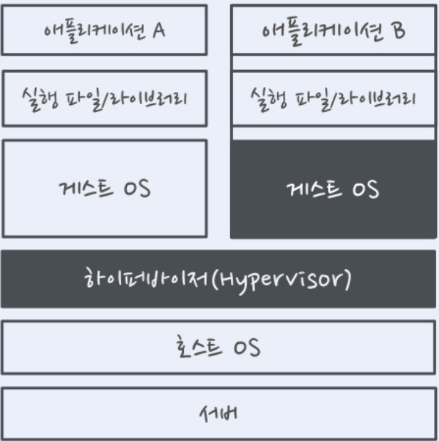
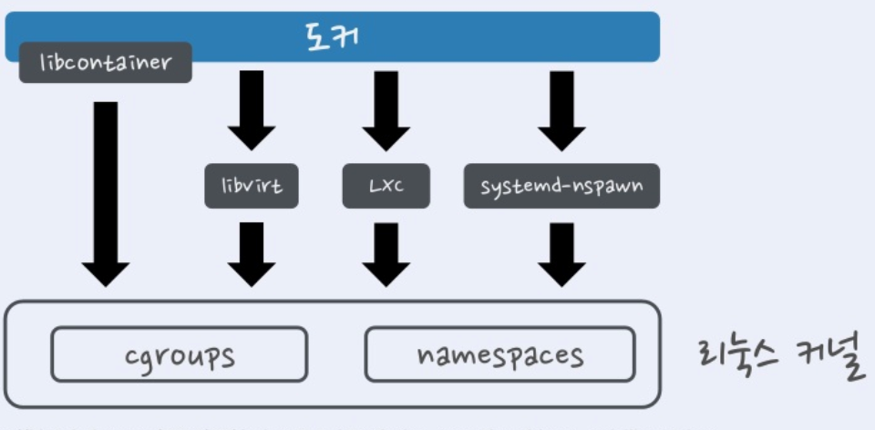
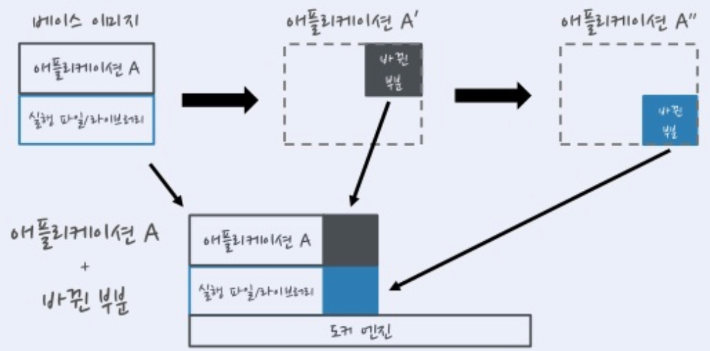
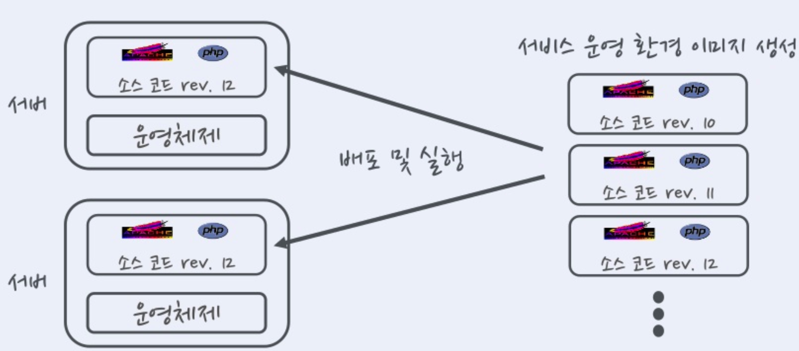
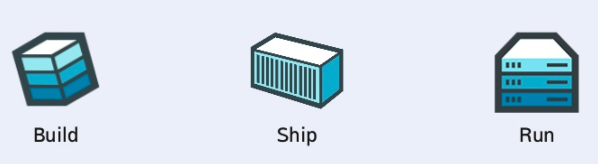

# Docker

## 도커란 무엇인가?

2013년 INC에서 출시한 오픈 소스 컨테이너
AWS, Google Clud Platform, MS Azure 클라우드 서비스 공식 지원

## 왜 도커를 사용 할까?

- 복잡한 리눅스 환경에서 컨테이너로 묶어서 실행이 가능하다.
- 개발, 테스트, 서비스 환경을 하나로 통일하여 효율적으로 관리 할 수 있다.
- 컨테이너(이미지)를 전 세계 사람들과 공유가 가능하다.  => 리눅스 커널에서 제공하는 컨테이너 기술을 이용
- Docker Hub를 제공한다.
- 컨테이너는 가상화보다 훨씬 가벼운 기술

## 가상 머신과 도커

- 컴퓨터 안에서 컴퓨터를 만들어내기 위한 시도(1960년대에 가상화 개념이 등장) 컴퓨터 성능이 좋아지면서 PC에서도 흔히 사용
- 서버의 성능이 향상됨에 따라 서버가 Task수행을 하지않은 경우가 더 많아지게되었음. 그래서 서버의 Task를 더욱 더 사용 시킬 수 있는 방법을 찾아내다가, 서버에 가상 머신을 여러개 띄워서 일을 더시키기로 하였음.

- 서버가 많아짐에 따라 서버자체를 가상머신에 집어 넣어서 돌리기로하여 가상 머신에 각종 서버프로그램, DB등을 설치하여 애플리케이션이나 웹사이트를 실행

- 미리구축한 가상 머신 이미지를 여러 서버에 복사하여 실행하면 이미지 하나로 서버를 계속 만들어 낼 수 있음 => 가상화기술

- 가상화 기술을 이용하여 서버를 임대해주는 클라우드 서비스
##  가상머신의 문제점

OS  컴퓨터 전체를 만들어 버리므로, 각종 성능 손실이 발생
인텔, AMD는 CPU 안에 가상화 기능을 넣기 시작

## 가상머신 문제점 해결
호스트와 커널을 공유하는 반 가상화 기술이 등장한다.

가상 머신은 완전한 컴퓨터 -> 항상 게스트 OS를 설치해야함
이미지 안에 OS가 포함 되기 때문에 이미지 용량이 커짐
네트워크로 가상화 이미지 부담스러움
오픈소스 가상화 소프트웨어는 OS 가상화에만 주력하므로 => 배포 관리 기능 부족

## 리눅스 컨테이너

컨테이너 안에 가상공간을 만들지만, 실행 파일을  호스트에서 직접 실행
리눅스 커널의 cgroups와 namespaces가 제공하는 기술
가상화가 아닌 격리 

도커는 리눅스 컨테이너를 사용한다.
- 초기에는 LXC(Linux Container)를 기반으로 구현
- 버전 0.9부터는 LXC를 대신하는 libcontainer를 개발하여 사용
- 실행 옵션으로 선택 가능

## 도커의 특징
도커는 게스트 OS를 설치하지 않음
- 이미지에 서버 운영을 위한 프로그램과 라이브러리만 격리해서 설치
- 이미지 용량이 크게 줄어듦
- 호스트와 OS 자원(시스템 콜)을 공유
도커는 하드웨어 가상화 계층이 없음
- 메모리 접근, 파일 시스템, 네트워크 전송 속도가 가상 머신해 비해 월등히 빠름
- 호스트와 도커 컨테이너 사이의 성능 차이가 크지 않음(오차 범위 안)
이미지 버전 관리도 제공하고 중앙 저장소에 이미지를 올리고 받을 수 있음(push / pull)
- Github와 비슷한 형태로 도커이미지를 공유하는 Docker Hub제공(Github 처럼 유료 저장소도 제공)
- 다양한 API 를 제공하여 원하는 만큼 자동화 가능 개발과 서버 운영에 매우 유용

## 도커 이미지란?
이미지는 서비스 운영에 필요한 서버 프로그램, 소스 코드, 컴파일된 실행 파일을 묶은 형태
(저장소에 올리고 받는건 이미지)

## 도커 컨테이너란?
컨테이너는 이미지를 실행한 상태
이미지로 여러 개의 컨테이너를 만들 수 있음

- 운영체제로 비유하면 이미지는 실행 파일이고, 컨테이너는 프로세스

## 도커는 이미지의 바뀐 부분을 어떻게 관리하지?
유니온 파일 시스템 형식(aufs, btrfs, devicemapper)

도커는 베이스 이미지에서 바뀐 부분만 이미지로 생성한다.
컨테이너로 실행할 때는 베이스 이미지와 바뀐 부분을 합쳐서 실행
Docker Hub 및 개인 저장소에서 이미지를 공유 할때 바뀐 부분만 주고 받는다.

## 서비스 운영 환경과 도커

서비스 운영 환경을 이미지로 생성한 뒤 서버에 배포하여 실행
서비스가 업데이트되면 운영 환경 자체를 변경하지 않고, 이미지를 새로 생성하여 배포
클라우드 플랫폼에서 서버를 쓰고 버리는 것과 같이 Immutable Infrastructure도 서비스 운영 환경 이미지를 한번 쓰고 버림.

## Immutable Infrastructure

호스트 OS와 서비스 운영 환경(서버 프로그램, 소스 코드, 컴파일 된 바이너리)을 분리
한 번 설정한 운영 환경은 변경하지 않는다(Immutable)

## Immutable Infrastructure 장점

- 편리한 관리

1. 서비스 환경 이미지만 관리하면 된다.
2. 중앙 관리를 통한 체게적인 배포와 관리
3. 이미지 생성에 버전 관리 시스템 활용

- 확장성
1. 이미지 하나로 서버를 계속 찍어낼 수 있음
2. 클라우드 플랫폼의 자동확장(Auto Scaling)기능과 연동하여 손쉽게 서비스 확장

- 테스트
1. 개발자 PC,테스트 서버에서 이미지를 실행만 하면 서비스 운영 환경과 동일한 환경이 구성된다.
2. 테스트 간편

- 가볍다
1. 운영체제와 서비스 환경을 분리하여 가볍고(Lightweight)어디서든 실행 가능한(Portable)환경 제공

## 도커의 요약

도커의 고래는 컨테이너를 싣고 다니는 고래 
고래는 서버에서 여러 개의 컨테이너(이미지)를 실행하고 이미지 저장과 배포(운반)을 의미한다.
도커(Docker)는 부두 노동자를 뜻하고 컨테이너를 다루는 도커의 기능과 비슷함

도커는 서비스 운영 환경을 묶어서 손쉽게 배포하고 실행하는 경량 컨테이너 기술

### Reference 

https://www.slideshare.net/pyrasis/docker-fordummies-44424016

