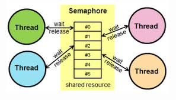
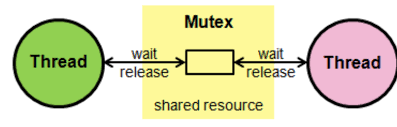

## 세마포어(Semaphore)

공유된 자원에 여러 프로세스, 쓰레드가 동시에 접근하면서 문제가 발생하는데, 공유된 자원 속 하나의 데이터는 한번에 하나의 프로세스만 접근 할 수 있도록 제한해 두어야할 필요성이 잇는데, 이를 위해 고안된 것이 Semaphore(세마포어)이다. 즉, 한 프로세서가 사용하고 있는 동안에 세마포어를 세워서 다른 프로세서를 대기시키고 사용이 끝나면 해제시키는 방법으로 사용한다.

### Example)

하나의 공간에는 하나의 사람만이 들어갈 수 있습니다. 단, 이때 Key를 사용하여 그 공간에 접근이 가능합니다. 여러 사람들이 동시에 그 하나의 공간에 접근한다는것은 불가능하다는 말입니다. A,B,C,D 라는 사람이 그 공간에 들어가서 Task를 실행할 때 A라는 사람이 먼저 공간에 Key를 가지고 들어갔다고 가정하겠습니다. 그러면 B,C,D의 사람은 A라는 공간에 들어가기 위해 대기를 하게 되겠지요? 이사람들은 키를 가지고 있지 않습니다. 그러면 A라는 사람이 Task를 모두 수행한 후, 방에 나오면서 다음사람인 B에게 Key를 건내주게 되면서 B라는 사람은 그 공간에서 Task를 수행 할 것입니다.
계속해서 C,D라는 사람은 위와 같은 과정을 반복하게 됩니다. 방이 4개이면 열쇠도 4개이고 한사람이 들어갈때마다 방과 열쇠의 갯수가 1개씩 감소하게된다. 뮤텍스와 다르게 같은 방의 개수와 Key를 가져야한다.
간단히 말해, 빈 방의 열쇠의 갯수이다.

## 뮤텍스(Mutex)

쓰레드들 간에 공유가 배제되는 객체, 공유된 자원이 데이터를 여러 쓰레드가 접근하는것을 막는 것이다. 파일과 같은 공유 자원이 수행 중 오직 한 프로그램이나 스레드에게만 소유되어야 할 필요가 있을 때 그 자원에 대한 뮤텍스 객체를 생성시킨다. 뮤텍스가 비신호 상태이면 프로그램은 자원을 점유하여 사용한 후 이를 반환하고, 다른 프로그램 또는 다른 스레드가 자원을 사용 중 
즉, 뮤텍스가 신호 상태이면 대기 상태로 들어가 끝나기를 기다린다. 뮤텍스는 여러 면에서 크리티컬 섹션(임계영역)과 비슷하고, 대신 사용할 수도 있지만 이름을 가질 수 있다는 점에서 크리티컬 섹션(임계영역)보다 우월하다.
간단히 말해, 방에 들어가기 위한 열쇠의 갯수이다.

### Example)

총 하나의 공간과 4명(A,B,C,D)가 있다고 가정하겠습니다. 그 중에 A라는 사람만 Key가 있다고 가정하겠습니다. Mutex에서는 무조건 1개의 Key만 가질 수 있습니다.
공간에 들어갈 수 있는 열쇠를 A가 가지고 있다면 A가 나와야지만 그 공간을 이용할 수 있습니다.

# 세마포어와 뮤텍스의 차이점

- 뮤텍스는 Key가 항상 1개이며, 세마포어는 Key를 여러개 가질 수 있습니다.
- 세마포어는 뮤텍스가 될 수 있지만, 뮤텍스는 세마포어가 될 수 없다.
- 세마포어는 파일시스템 상 파일형태로 존재, 뮤텍스는 프로세스 범위이다.
- 세마포어는 소유할 수 없는 반면, 뮤텍스는 소유할 수 있습니다.
- 뮤텍스의 경우, 뮤텍스를 소유하고 있는 쓰레드가 이 뮤텍스를 해제할 수 있습니다.
- 세마포어의 경우, 세마포어를 소유하고 있지 않은 쓰레드도 이 세마포어를 해제할 수 있습니다.

