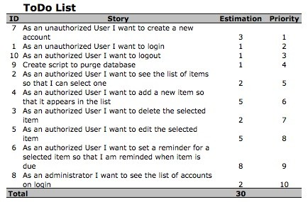
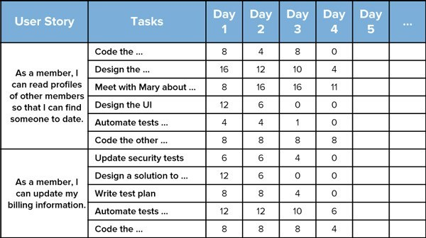
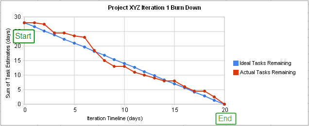

# 애자일(Agile)이란?

폭포수모델과 다르게 단방향적인 개발 모델이 아니라, 짧은 주기를 가지고 눈에 보이는 결과물을 만들어내며 클라이언트와 소통한다.

그 다음 주기에서는 수정사항을 반영하여 계획하고, 개발을 수행한다. 이런식으로 주기를 계속반복하여 최종적으로 클라이언트가 원하는 제품에 가장 근접하게 개발할 수 있도록 하는것이 애자일이다.

# 애자일 방법론

종류에는 스크럼, 칸반, XP 등 여러 방식이 존재하며, 각자 다른 목적에 특화되어 있음.

# 스크럼 방법론(Scrum)

유지보수보다는 개발에 초점이 맞추어진 애자일 방법론이다.

Exmaple) 미식축구 횡대 자세

# 스크럼 프로세스(Scrum Process)

# 제품 백로그(Product Backlog)

사용자를 조사하여 구현해야 할 사항을 정의한 문서

다양한 요구명세가 있고, 우선순위로 나누어져 있음.

이것의 관리자는 "제품 책임자(Product Owner)"가 수정 삭제 가능

제품 책임자는 하나의 스프린트가 끝나면 제품을 백로그 업데이트하여 스프린트 회의때 제시

# 제품 백로그(Product Backlog) 작성법

- 우선 순위 있는 요구명세(구현에 대한 디테일 한 명세는 필요 없음)

- 요구 삽입, 수정, 삭제 가능

- 우선순위 순으로 백로그 작성

# 제품 백로그(Product Backlog) 문서

# 스프린트 백로그(Sprint Backlog)

- 제품 책임자와 스크럼팀이 모여 하는 스프린트 회의시 결정되는 것으로, 요구사항을 테스크로 구체화 한 문서이다.

- TDD 주도 계획이 포함되어야 한다.

- 원칙상 수정 불가능

# 스프린트 백로그(Sprint Backlog) 문서

# 스프린트 백로그 번다운 차트(Sprint Backlog Burndown Chart)

- X축 = 스프린트 구성 일자

- Y축 = 잔여 작업량

- 스프린트가 종료에 가까워 질수록 작업량은 감소한다.

- Task 진행 상태를 추적 할 수 있다.

# 스크럼 구성원

> 제품 책임자 (Product Owner) : 클라이언트와 스크럼 팀 사이에서 의견을 취합하여 제품의 특성과 기능을 정의하여 백로그를 작성하고, 출시 일자와 내용을 결정한다. 수익성에 대한 책임이 있고 시장 가치에 따라 구현할 특성과 기능에 우선순위를 부여한다.

> 스크럼 마스터 (Scrum Master) : 팀이 완전히 생산적이고 기능적이게 움직일 수 있도록 보장해 준다. 외부에서 간섭하고 방해하는 장애물을 제거하여 팀을 보호하고 스크럼 프로세스가 준수되도록 보장한다. 일일 스크럼, 스프린트 계획 및 리뷰회의에 참석한다.

> 이해 관계자 : 제품에 관련되어 있으나 생산과 제품 제공에 대한 책임은 없는 사람들을 말한다.

> 스크럼 팀 (Scrum Team) : 스크럼에서 제품의 생산에 참여하는 인원을 말한다. 개발자, 디자이너 등등이 모여 구성원을 이루고 있다.

# 스크럼 프로세스 

- 1. 제품 책임자가 이해관계자와 프로젝트 관계자들의 의견을 취합하여 제품 백로그 작성
- 2. 스프린트 계획 미팅 진행 (스프린트 목표 설정, 스프린트 백로그 작성)
- 3. 스프린트 주기동안 제품 제작 (일일 스탠드업 회의 진행하여 팀원간 정보 공유)
- 4. 스프린트 종료 시 모든 이해관계자가 모인 자리에서 회의 진행
- 5. 스프린트 회고
- 6. 다시 1번으로 돌아가서 반복

# 일일 스크럼 회의

15분간 회의하며, 전체팀원이 모여 진척 상황을 공유한다

# 제품 백로그 추정 단위

- Idea Time : 간섭 방해 없다고 가정시, 한 사람이 사용가능한 시간의 양
- Calendar Time : 작업 시간을 예상하며 측정하는 기존 방식

# 스프린트 계획

스프린트 계획 회의, 스프린트 리뷰, 스프린트 회고 회의

스프린트 계획 회의시 제품 책임자는 최신 버전의 제품 백로그 (지난 스프린트때 만든 결과물을 가지고 이해관계자의 의견을 취합하여 수정사항을 업데이트한 백로그)를 지참하여야 한다.

참여자: 스크럼 팀원, 제품 책임자, 스크럼 마스터가 참여

> 제품 백로그로 부터 항목 선정 및 논의
> 항목을 작업 가능한 태스크로 분할
> 각 태스크에 대한 작업량 추정
> 팀 역량이 남아있는 동안 다음 항목에 대해 반복
> 팀 역량이 모두 할당되면 스프린트 계획 종료

# Risk Buffer

 예상치 못한 일의 발생, 팀원의 역량 부족으로 인한 시간 초과 등에 대비해 남겨 두는 예비
 시간 자원

# 스프린트 원칙

1. 스프린트 기간 중에는 비즈니스 우선순위를 바꾸지 않음(요구 사항 변경 허용하지 않음)
2. 다음 스프린트 시작 전 백로그에 작성하여야 하며, 진행 중인 스프린트에 대한 변경은 이루어 져서는 안된다.
3. 스프린트가 비정상 종료 될 경우는 변경을 저지할 수 없는 경우
4. 모든 팀원들이 공유하여야 하고, 제품 책임자가 결정한다.
5. 모든 스프린트는 같은 길이를 유지하여야 한다.
6. 반드시 스프린트를 연속적으로 운영하며, 정해진 시간안에 끝내야 한다.
7. 스프린트는 제 때 홍보하고, 규칙적으로 설정하고 따라야 한다.

# 릴리즈 스프린트

모든 스프린트는 실행 가능한 제품의 일부 완성을 목표로 한다. 스프린트 완료 후 손질 작업은 릴리즈 스프린트에서 수행하며, 스트레스 테스트, 성능 테스트, 사용성 테스트와 문서 작업을 완료한다.
